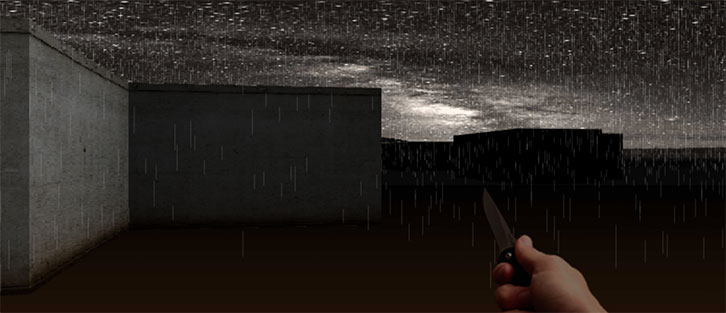

Today, let's drop into a world you can reach out and *touch*.
In this article, we'll compose a first-person exploration from scratch,
in 250 lines and without difficult math, using a technique called raycasting.
You may have seen it before in games like Daggerfall and Duke Nukem 3D,
or more recently in Notch Persson's ludum dare entries.
If it's good enough for Notch, it's good enough for me!
[ [Demo] ](/demos/raycaster)
[ [Source] ](https://github.com/hunterloftis/playfuljs/blob/master/content/demos/raycaster.html)

[](/demos/raycaster)

Raycasting feels like cheating, and as a lazy programmer, I love it.
You get the immersion of a 3D environment without many of the
complexities of "real 3D" to slow you down.
For example, raycasts run in constant time,
so you can load up a massive world and it will *just work*, without optimization,
as quickly as a tiny world.
Levels are defined as simple grids rather than as trees of polygon meshes,
so you can dive right in without a 3D modeling background or mathematics PhD.

It's one of those techniques that blows you away with simplicity.
In fifteen minutes you'll be taking photos of your office walls and
checking your HR documents for rules against "building workplace gunfight simulations."

### The Player

Where are we casting rays from? That's what the player is all about.
We need just three properties: x, y, and direction.

```js
function Player(x, y, direction) {
  this.x = x;
  this.y = y;
  this.direction = direction;
}
```

### The Map

We'll store our map as a simple two-dimensional array.
In this array, 0 represents *no wall* and 1 represents *wall*.
You can get a lot more complex than this... for example,
you could render walls of arbitrary heights, or you could
pack several 'stories' of wall data into the array,
but for our first attempt 0-vs-1 works great.

```js
function Map(size) {
  this.size = size;
  this.wallGrid = new Uint8Array(size * size);
}
```

### Casting a ray

Here's the trick: a raycasting engine *doesn't draw the whole scene at once.*
Instead, it divides the scene into independent columns and renders them one-by-one.
Each column represents a single ray cast out from the player at a particular angle.
If the ray hits a wall, it measures the distance to that wall and draws a rectangle in its column.
The height of the rectangle is determined by the distance the ray traveled -
more distant walls are drawn shorter.


The more rays you draw, the smoother the result.

#### 1. Find each ray's angle

First, we find the angle at which to cast each ray.
The angle depends on three things: the direction the player is facing,
the field-of-view of the camera, and which column we're currently drawing.

```js
var angle = this.fov * (column / this.resolution - 0.5);
var ray = map.cast(player, player.direction + angle, this.range);
```

#### 2. Follow each ray through the grid

Next, we need to check for walls in each ray's path.
Our goal is to end up with an array that lists each wall the ray
passes through as it moves away from the player.


Starting from the player, we find the nearest horizontal (*stepX*) and
vertical (*stepY*) gridlines.
We move to whichever is closer and check for a wall (*inspect*).
Then we repeat until we've traced the entire length of each ray.

```js
function ray(origin) {
  var stepX = step(sin, cos, origin.x, origin.y);
  var stepY = step(cos, sin, origin.y, origin.x, true);
  var nextStep = stepX.length2 < stepY.length2
    ? inspect(stepX, 1, 0, origin.distance, stepX.y)
    : inspect(stepY, 0, 1, origin.distance, stepY.x);

  if (nextStep.distance > range) return [origin];
  return [origin].concat(ray(nextStep));
}
```

Finding grid intersections is straightforward: just look for whole numbers of *x* (1, 2, 3, etc).
Then, find a matching y by multiplying by the line's slope (rise / run).

```js
var dx = run > 0 ? Math.floor(x + 1) - x : Math.ceil(x - 1) - x;
var dy = dx * (rise / run);
```

Did you notice what's awesome about this part of the algorithm?
We don't care how big the map is!
We're only looking at specific points on the grid - approximately the same number of points each frame.
Our example map is 32 x 32, but a map that's 32,000 x 32,000 would run just as quickly!

#### 3. Draw a column

Once we've traced a ray, we need to draw any walls that it found in its path.

```js
  var z = distance * Math.cos(angle);
  var wallHeight = this.height * height / z;
```

We determine the height of each wall by dividing its maximum height by *z*.
The further away a wall is, the shorter we draw it.

Oh damn, where did this *cosine* come in?
If we just use the raw distance from the player, we'll end up with a fisheye effect.
Why? Imagine that you're facing a wall. The edges of the wall to your left and right
are further away from you than the center of the wall.
But you don't want straight walls to buldge out in the middle!
To render flat walls as we really see them, we build a triangle out of each ray
and find the perpendicular distance to the wall with cosine. Like this:


And I promise, that's the hardest math in this whole thing.

### Render the damn thing!

Let's use a Camera object to draw the map each frame from the player's perspective.
It will be responsible for rendering each strip as we sweep from the
left to the right of the screen.

Before it draws the walls, we'll render a skybox -
just a big picture in the background with stars and a horizon.
After the walls are done we'll drop a weapon into the foreground.

```js
Camera.prototype.render = function(player, map) {
  this.drawSky(player.direction, map.skybox, map.light);
  this.drawColumns(player, map);
  this.drawWeapon(player.weapon, player.paces);
};
```

The camera's most important properties are resolution, field-of-view (fov), and range.
- *Resolution* determines how many strips we draw each frame: how many rays we cast.
- *Field-of-view* determines how wide of a lens we're looking through: the angles of the rays.
- *Range* determines how far away we can see: the maximum length of each ray.

### Putting it all together

We'll use a Keyboard object to listen for the arrow keys and a GameLoop object
to call requestAnimationFrame. Our simple gameloop is just three lines:

```js
loop.start(function frame(seconds) {
  map.update(seconds);
  player.update(keyboard.states, map, seconds);
  camera.render(player, map);
});
```

### The details

#### Rain

Rain is simulated with a bunch of very short walls in random places.

```js
var rainDrops = Math.round(Math.random() * s / 4 + 0.05);
var rain = rainDrops && this.project(0.1, angle, step.distance);

ctx.fillStyle = '#ffffff';
ctx.globalAlpha = 0.1;
while (rainDrops--) ctx.fillRect(left, Math.random() * rain.top, 1, rain.height);
```

Instead of drawing the walls at their full width, we draw them one pixel wide.

#### Lighting and lightning

The lighting is actually shading.
All walls are drawn at full brightness, and then covered with a black rectangle of some opacity.
The opacity is determined by distance as well as by the wall's orientation (N/S/E/W).

```js
ctx.fillStyle = '#000000';
ctx.globalAlpha = Math.max((step.distance + step.shading) / this.lightRange - map.light, 0);
ctx.fillRect(left, wall.top, width, wall.height);
```

To simulate lightning, *map.light* randomly spikes to 2 and then quickly fades down again.

#### Collision detection

To prevent the player from walking through walls,
we just check his future position against our map.
We check x and y independently so the player can slide along a wall:

```js
Player.prototype.walk = function(distance, map) {
  var dx = Math.cos(this.direction) * distance;
  var dy = Math.sin(this.direction) * distance;
  if (map.get(this.x + dx, this.y) <= 0) this.x += dx;
  if (map.get(this.x, this.y + dy) <= 0) this.y += dy;
};
```

#### Wall textures

The walls would be pretty boring without a texture.
How do we know which part of the wall texture to apply to a particular column?
It's actually pretty simple: we take the remainder of our intersection point:

```js
step.offset = offset - Math.floor(offset);
var textureX = Math.floor(texture.width * step.offset);
```

For example, an intersection with a wall at (10, 8.2) has a remainder of 0.2.
That means that it's 20% from the left edge of the wall (8) and 80% from the right edge (9).
So we multiply 0.2 * texture.width to find the x-coordinate for the texture image.

### What's next?

Because raycasters are so fast and simple, you can try lots of ideas quickly.
You could make a dungeon crawler, first-person shooter, or a grand-theft-auto style sandbox.
Hell, the constant-time makes me want to build an oldschool MMORPG with a massive,
procedurally generated world.
Here are a few challenges to get you started:

- Immersion. This example is begging for full-screen mouse-lock with a rainy background
and thunderclaps synchronized to the lightning.
- An indoors level. Replace the skybox with a symmetric gradient or, if you're feeling
plucky, try rendering floor and ceiling tiles (think of it this way: they're just
the spaces between the walls you're already drawing!)
- Touch controls. One of the nice things about a raycaster is that it doesn't
depend on a GPU or 3D graphics system, so a small modification will get this
example screaming on an iPad. Probably need to lose the rain.
- Lighting objects. We already have a fairly robust lighting model.
Why not place lights in the world and compute wall lighting based on them?
Lights are 80% of atmosphere.

As always, if you build something cool, or have related work to share,
[email me](mailto:hunter@hunterloftis.com) or [tweet me](http://twitter.com/hunterloftis)
and I'll shout it from the rooftops.

### Credits

This "two hour" article turned into a "three week" article,
and it would never have been released without several peoples' help:

- [Jim Snodgrass](http://twitter.com/snodgrass23): editing
- [Jeremy Morrell](http://twitter.com/jeremymorrell): editing
- [Jeff Peterson](http://twitter.com/jeffpeterson): editing
- [Chris Gomez](http://github.com/akagomez): weapons
- [Amanda Lenz](http://etsy.com/helenedorothy): laptop bags and support
- [Nicholas S](http://shadowh3.deviantart.com/art/Wall-Texture-73682375): wall texture
- [Dan Duriscoe](http://apod.nasa.gov/apod/ap070508.html): Death Valley skybox
